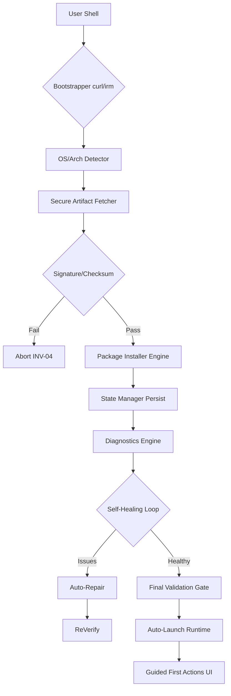

# Open.Bionic Universal Installer Specification v2.1

> **Binding Engineering Contract**
> Supersedes all prior installation logic.
> Target: Single-command, zero-download, GitHub-native installer.

---

## 🔧 PROJECT PARAMETERS

| Parameter | Value |
|-----------|-------|
| **ORG_NAME** | `Ahmadkhaled11` |
| **REPO_NAME** | `Open.Bionic` |
| **PROJECT_NAME** | `Open.Bionic` |
| **TOOL_BINARY_NAME** | `open_bionic` |
| **INSTALL_DIR_UNIX** | `~/.open_bionic` |
| **INSTALL_DIR_WINDOWS** | `%LOCALAPPDATA%\Open.Bionic` |
| **MIN_INSTALLER_REVISION** | `1` |
| **SUPPORTED_PLATFORMS** | `darwin`, `linux`, `windows` |
| **SUPPORTED_ARCHS** | `amd64`, `arm64` |

---

## 🎯 CORE OBJECTIVE

Deliver a **single-command installer** that:
1.  Installs directly from **GitHub Releases** (no clones).
2.  Is **idempotent, self-healing, and self-upgrading**.
3.  Enforces **INV-08/09** (GitHub Releases only).
4.  Passes all **CI validation scenarios**.

---

## 🔧 ONE-COMMAND ENTRYPOINT

| Platform | Command |
|---------|---------|
| **macOS / Linux** | `curl -fsSL https://github.com/Ahmadkhaled11/Open.Bionic/releases/latest/download/install.sh | sh` |
| **Windows (PowerShell)** | `irm https://github.com/Ahmadkhaled11/Open.Bionic/releases/latest/download/install.ps1 | iex` |

---

## 🏗️ ARCHITECTURE & FLOW



### Key Components
1.  **Bootstrapper**: Ephemeral, platform-native (sh/ps1).
2.  **Artifact Fetcher**: Strict Allowlist (`github.com/.../releases/download/...`).
3.  **State Manager**: Atomic JSON persistence (`state.json`).
4.  **Diagnostics**: Runtime health checks (deps, permissions).
5.  **Healer**: Auto-fixer for common issues.

---

## 🛡️ SECURITY & TRUST

-   **Artifact Source**: GitHub Releases ONLY (INV-09).
-   **Verification**: SHA-256 Checksums + Signatures.
-   **Least Privilege**: No auto-elevation.
-   **Network**: No 3rd party CDNs.

---

## 📦 ARTIFACT MANIFEST (Release Assets)

Every GitHub Release MUST contain:
1.  `installer-darwin-amd64`
2.  `installer-darwin-arm64`
3.  `installer-linux-amd64`
4.  `installer-windows-amd64.exe`
5.  `install.sh` (Bootstrapper)
6.  `install.ps1` (Bootstrapper)
7.  `checksums.txt`
8.  `signature.sig`
9.  `manifest.json`

---

## 🧾 INVARIANTS (Enforced)

| ID | Invariant | Check |
|----|-----------|-------|
| **INV-01** | **Idempotency** | Re-running 10x produces same result |
| **INV-02** | **Clean State** | No partial installs persist |
| **INV-03** | **Data Safety** | Upgrades never delete user data |
| **INV-04** | **Integrity** | Binary execution blocked if signature fails |
| **INV-05** | **Resumability** | Install picks up from `state.json` |
| **INV-06** | **Validation** | Binary launched only after `0` exit code smoke test |
| **INV-07** | **Diagnostics** | Diagnostics run on every execution |
| **INV-08** | **No Clones** | `git clone` usage = CI FAILURE |
| **INV-09** | **Source Truth** | URLs must match `/releases/download/` |

---

## 🤖 CI ENFORCEMENT POLICY

### Job: `installer-contract-validation`
1.  **Static Analysis**: Scan for forbidden strings (`git clone`, `tar.gz`, etc.).
2.  **Network Trace**: Fail if outbound traffic != `github.com`.
3.  **Idempotency Test**: Run installer 3x sequentially.
4.  **Spec Diff**: Ensure implementation matches this spec.

---

## 👥 UX: GUIDED ACTIONS

**Success State:**
```text
✅ Installation complete. Open.Bionic is ready.

🔍 Final health check...
✔ Runtime healthy
✔ Dependencies OK

🎯 What would you like to do?
1) Start Open.Bionic          [default in 5s]
2) Run full diagnostics
3) View docs
4) Exit
```

**Failure State:**
```text
⚠️ Issue detected: Missing dependency.
Fixing it automatically...
✔ Fixed.
Resuming installation...
```

---

## 📂 FILE STRUCTURE REORGANIZATION

All installation-related files will move to `/installations`:

```
/installations
  ├── bootstrap/
  │   ├── install.sh
  │   └── install.ps1
  ├── core/
  │   ├── detector.go
  │   ├── fetcher.go
  │   ├── installer.go
  │   └── healer.go
  ├── ci/
  │   └── installer-policy.yml
  └── specs/
      ├── installer_spec.md
      └── state_machine.md
```
